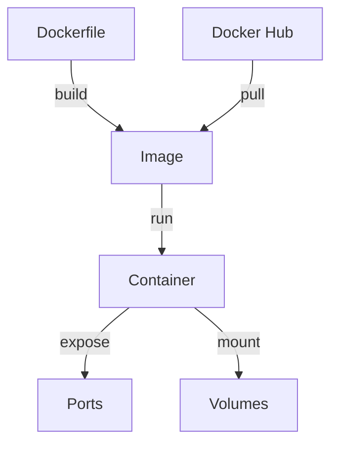

Docker has revolutionized how we develop and deploy software. In this post, we'll go through the essentials.

## What is Docker?

Docker packages your application and its dependencies into a **container** — a lightweight, portable unit that runs the same everywhere.

:::tip
If you can run Docker on your machine, you can run *any* containerized app regardless of the underlying OS or installed packages.
:::

## Architecture Overview

Here's how Docker components relate to each other:



## Key Commands

| Command | Description |
|---------|-------------|
| `docker build -t myapp .` | Build an image |
| `docker run -p 3000:3000 myapp` | Run a container |
| `docker ps` | List running containers |
| `docker compose up` | Start multi-container app |

## Understanding Layers

Each instruction in a Dockerfile creates a **layer**. Docker caches layers to speed up builds. The math behind cache invalidation probability for $n$ layers is:

$$P(\text{cache hit}) = \prod_{i=1}^{n} (1 - p_i)$$

where $p_i$ is the probability of layer $i$ changing.

:::warning
Always put frequently-changing instructions (like `COPY . .`) near the **end** of your Dockerfile to maximize cache hits.
:::

## A Simple Dockerfile

```dockerfile
FROM node:20-alpine
WORKDIR /app
COPY package*.json ./
RUN npm ci
COPY . .
EXPOSE 3000
CMD ["npm", "start"]
```

## Docker Compose

For multi-service apps, `docker-compose.yml` is essential:

```yaml
version: '3.8'
services:
  web:
    build: .
    ports:
      - "3000:3000"
    depends_on:
      - db
  db:
    image: postgres:16
    environment:
      POSTGRES_DB: myapp
```

:::gotcha
`depends_on` only waits for the container to **start**, not for the service inside to be **ready**. Use health checks for proper ordering.
:::

## Next Steps

- Explore multi-stage builds for smaller images
- Learn about Docker networking
- Set up CI/CD pipelines with Docker

Happy containerizing!
