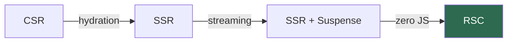
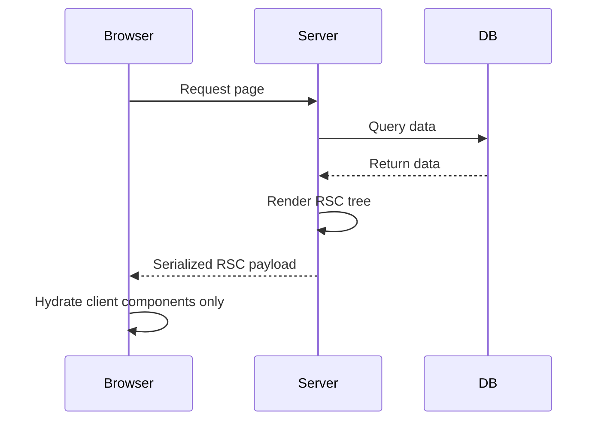

React Server Components (RSC) represent a paradigm shift in how we think about rendering. Let's demystify them.

## The Rendering Spectrum



Traditional Client-Side Rendering sends an empty HTML shell. SSR pre-renders on the server but ships all the JavaScript. RSC sends **rendered UI with zero client JS** for server components.

## Mental Model

Think of RSC as a formula for the total JavaScript bundle size $J$:

$$J = \sum_{i \in \text{client}} s_i$$

Only **client components** contribute to bundle size. Server components have $s_i = 0$.

:::tip
The `"use client"` directive doesn't make a component *bad* — it marks the boundary where interactivity begins. Keep these boundaries as low in the tree as possible.
:::

## Server vs Client Components

| Feature | Server Component | Client Component |
|---------|-----------------|------------------|
| `useState` / `useEffect` | ❌ | ✓ |
| Access DB / filesystem | ✓ | ❌ |
| Ships JS to browser | ❌ | ✓ |
| Can render client components | ✓ | ✓ |
| Can render server components | ✓ | ❌ |

## Composition Pattern

The key insight: server components can **pass** client components as children:

```tsx
// ServerLayout.tsx (server component)
export default function Layout() {
  const data = await db.query("SELECT * FROM posts");
  return (
    <main>
      <InteractiveSearch /> {/* client component */}
      {data.map(post => (
        <PostCard key={post.id} post={post} />
      ))}
    </main>
  );
}
```

:::warning
You cannot **import** a server component inside a client component. But you can pass it as `children` props — this is the composition escape hatch.
:::

## Data Flow



## When to Use RSC

**Use server components for:**
- Data fetching
- Heavy dependencies (markdown parsers, syntax highlighters)
- Access to backend resources

**Use client components for:**
- Interactivity (forms, buttons, hover states)
- Browser APIs (localStorage, geolocation)
- Effects and state

:::gotcha
RSC payload is **not HTML** — it's a special serialized format that React uses to reconcile the component tree. This is why you can't just "view source" and see the full page.
:::

RSC is still evolving, but the core mental model is stable: push as much as possible to the server, and only ship JavaScript for what actually needs interactivity.
