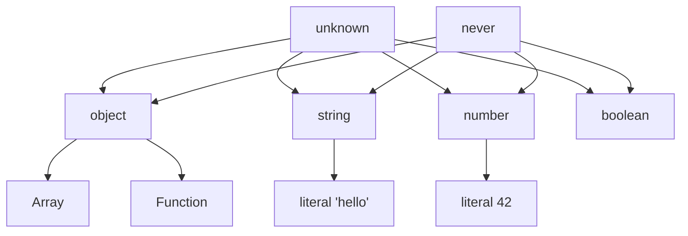

Generics are one of TypeScript's most powerful features. Let's build up from first principles.

## Why Generics?

Without generics, you either lose type safety or duplicate code:

```typescript
function firstElement(arr: any[]): any {
  return arr[0]; // No type info!
}

function firstString(arr: string[]): string {
  return arr[0]; // Only works for strings
}
```

With generics:

```typescript
function first<T>(arr: T[]): T | undefined {
  return arr[0];
}

const num = first([1, 2, 3]); // number
const str = first(["a", "b"]); // string
```

## Generic Constraints

Use `extends` to constrain what types are accepted:

```typescript
interface HasLength {
  length: number;
}

function longest<T extends HasLength>(a: T, b: T): T {
  return a.length >= b.length ? a : b;
}
```

:::tip
Think of `extends` in generics as "must be at least" — not class inheritance but structural compatibility.
:::

## Conditional Types

The real power emerges with conditional types:

```typescript
type IsString<T> = T extends string ? true : false;

type A = IsString<"hello">; // true
type B = IsString<42>;      // false
```

The general form is: $T \text{ extends } U \text{ ? } X : Y$

## Type Relationships



## Mapped Types

Transform existing types property by property:

```typescript
type Readonly<T> = {
  readonly [K in keyof T]: T[K];
};

type Partial<T> = {
  [K in keyof T]?: T[K];
};
```

:::warning
Mapped types iterate over `keyof T` which only includes **known** keys. Index signatures behave differently.
:::

## Inference with `infer`

Extract types from complex structures:

```typescript
type ReturnType<T> = T extends (...args: any[]) => infer R ? R : never;

type UnpackPromise<T> = T extends Promise<infer U> ? U : T;
```

:::gotcha
`infer` only works inside `extends` clauses of conditional types. You can't use it in regular type positions.
:::

## Putting It All Together

A type-safe event emitter:

```typescript
type EventMap = {
  click: { x: number; y: number };
  focus: { target: string };
};

class Emitter<T extends Record<string, any>> {
  on<K extends keyof T>(event: K, handler: (payload: T[K]) => void) {
    // ...
  }
  emit<K extends keyof T>(event: K, payload: T[K]) {
    // ...
  }
}
```

Generics transform TypeScript from a type-checked JavaScript into a language capable of expressing almost any type-level computation.
